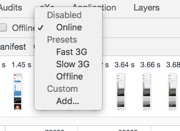
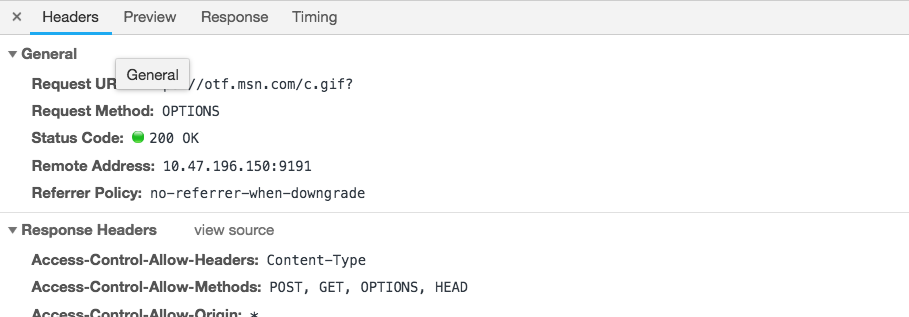

The network tab in Chrome dev tools offers a number of troubleshooting helpers for sniffing out problems with page load and network requests.
This tab displays a waterfall detailing how long a page takes to load, and the time each resource contributes to that load time.

You can see if large JS files, images, or other large requests are causing your page speed to lag. You can also view snapshots with a visual history of your page load in this tab.

Another useful feature of the network tab is the ability to view a site while simulating a slow connection. The downward arrow at the far left lets the user select from a number of speeds; try selecting `slow 3g` and reloading the page- this is how the page loads for users with slow 3G connections.

The network tab also gives a ton of details about network requests that are being made. You can filter requests by type, view request and response headers for a particular request, and the timing of that request.

 You can also choose to block a particular request or domain and reload the page, simulating the outage of an API.

This concludes my four-part series on Dev tools: stay tuned for another post coming soon that will detail some of the lesser-known tabs in Chrome Dev Tools!
