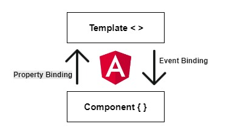

In the Angular framework, components are made with a template (either a string contained in the component decorator or a separate file linked to in the templateURL property) and a javascript class that provides the component controller logic. Angular provides a number of features to pass data and events between the template and the component class; these include string interpolation and property binding to pass data into the template, event binding to trigger events based on interaction with the template, and two-way binding, which handles both. 

Here is a brief description and example of each:

## Property Binding

Property binding in Angular uses the following syntax: `[property]="value"`. The selected property of a DOM element is assigned a value based on the component's controller class. This value can be of several types, including boolean (`[disabled]="true"`), string (`[innerText]="myString"`), and number (`[value]="myNumber"`). Remember, this changes DOM **properties**, not HTML **attributes**. (For more on the differences between HTML properties and attributes, check out [this](https://javascript.info/dom-attributes-and-properties) excellent article.)

Here's an example of property binding in an Angular component:

```js
import { Component } from '@angular/core';

@Component({
    selector: 'property-binding',
    template: `<div>
                 <h1 [innerText]="myTitle"></h1>
               </div>`
})
export class PropertyBindingComponent {
    myTitle: string = 'Hello, World';
}
```


## String Interpolation


String Interpolation in Angular will be very familiar to anyone who has worked with es6 string templates:

``` `this is a string with a dynamic ${value}` ```

 All you need to do is insert a pair of double curly brackets in your template markup and the JS that you put inside will be evaluated to a string. 

For example, if you have a person object in your component class like this:

 `const person = {name: "John"}`

 and your component template has the following paragraph

  `<p>Hi, my name is {{ person.name }}.</p>`

  it will be rendered as:
  
   **"Hi, my name is John."**

Here is a more complete example of string interpolation in an Angular component:

```js
import { Component } from '@angular/core';

@Component({
    selector: 'string-interpolation',
    template: `<div>
                 <h1>{{ myTitle }}</h1>
               </div>`
})
export class StringInterpolationComponent {
    myTitle: string = 'Hello, World';
}
```

## Event Binding
While property binding and string interpolation are useful features for passing data from the controller class to the template, event binding works the other way. With event binding, an event on the template can trigger a method within the controller class of the component. Event binding takes the following syntax:

```js (event)="handlerFunction()" ```

When the bound event occurs, the handlerFunction will be triggered.

Here is a more detailed example of event binding on an Angular component:

```js
import { Component } from '@angular/core';

@Component({
    selector: 'event-handling',
    template: `<div>
                 <button 
                   (click)="handleClick()"
                   >
                   Press This Button!
                   </button>
               </div>`
})
export class EventHandlingComponent {
    handleClick(){
      console.log('the event has been handled!')
    }
}
```


## Two-Way Binding

What if you want to pass data both ways? Two-way binding offers exactly that option. With two-way binding in place, a change to the template will trigger a change in the bound value within the component controller class, and a change in the bound value will also trigger a change in the template. Two-way binding uses the following syntax (sometimes referred to as "banana-in-a-box"):

``` [(boundProperty)]="value" ```

This can be especially useful in cases like input fields where you might want changes to propagate both ways.

Here is an example of two-way binding in the context of an Angular component:

```js
import { Component } from '@angular/core';

@Component({
    selector: 'two-way-binding',
    template: `<div>
                 <input [(ngModel)]="name"/>
               </div>`
})
export class TwoWayBindingComponent {
    name: string = 'John Potts';
}
```

***

I hope this helped you understand property binding, string interpolation, event binding, and two-way binding in Angular. For more information on any of this I highly recommend the official [Angular Documentation](https://angular.io/docs).
